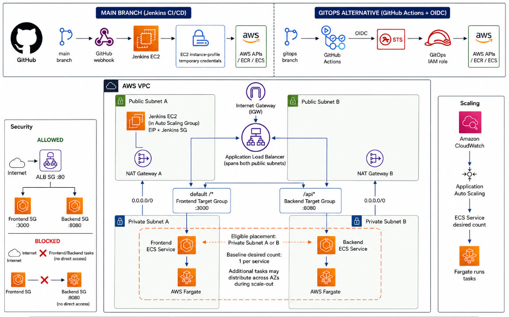

# Secure AWS ECS Fargate CI/CD Platform

A two-service application deployed to AWS ECS Fargate with Terraform,
automated Jenkins CI/CD, container security gates, immutable ECR delivery,
runtime validation, and CPU-based Application Auto Scaling.Secure ECS/Fargate CI/CD platform: Terraform-provisioned AWS infrastructure, Jenkins pipeline using instance-profile credentials, GitHub Actions deploy path using OIDC, Checkov and Trivy gates, immutable ECR images, and target-tracking autoscaling.

> **Two delivery paths, two branches**
>
> | Path | Branch | What it demonstrates |
> |---|---|---|
> | Jenkins | `main` | EC2 instance-profile credentials, Checkov and Trivy gates, immutable ECR images, post-deploy validation |
> | GitHub Actions + OIDC | [`gitopa`](https://github.com/uzobola/ecs-fargate-cicd-pipeline/tree/gitops) | Short-lived STS credentials through GitHub OIDC federation; no AWS access keys stored in GitHub. [Workflow file](https://github.com/uzobola/ecs-fargate-cicd-pipeline/blob/gitops/.github/workflows/deploy.yml) |
>

---

## Overview

The application consists of:

```text
React frontend
    |
    | /api
    v
Express backend
```

AWS exposes both services through one public Application Load Balancer.

```text
Internet
    |
    v
Application Load Balancer
    |
    +---- default /* ----> Frontend ECS service :3000
    |
    +---- /api* ---------> Backend ECS service :8080
```

The deployed frontend displays:

```text
SUCCESS: <GUID>
```

when frontend-to-backend communication is working.

---

**Jump to:**

- [Architecture](#architecture)
- [CI/CD Delivery Flow](#cicd-delivery-flow)
- [Security Controls](#security-controls)
- [Verified Outcomes](#verified-outcomes)
- [Reproduce the Environment](#reproduce-the-environment)
- [Validation Evidence](#validation-evidence)

---

## What This Demonstrates

- **Infrastructure as Code** — Terraform provisions the two-AZ VPC, ALB,
  ECS/Fargate services, Application Auto Scaling, ECR, IAM, CloudWatch, and
  Jenkins infrastructure.

- **Automated CI/CD** — GitHub webhooks trigger Jenkins to build, scan, publish,
  deploy, wait for ECS stability, and validate the live application.

- **Security-focused delivery** — Checkov provides IaC findings, Trivy blocks
  fixable HIGH/CRITICAL container findings, ECR tags are immutable, and AWS
  deployment credentials are temporary.

- **Least-privilege identity boundaries** — Jenkins uses EC2
  instance-profile-based temporary AWS credentials, GitHub Actions uses OIDC
  federation to AWS STS, and frontend/backend workloads use separate execution
  roles with no application task role.

- **Private application runtime** — Fargate tasks run without public IPs and
  accept application traffic only from the ALB security group.

- **Validated scaling** — CPU target tracking scales each ECS service between
  1 and 4 tasks; controlled load testing demonstrated backend scale-out from
  1 to 2 running tasks.

---

# Architecture



For the full runtime, network, identity, scaling, and control-plane model, see
[Architecture](docs/architecture.md).

```text
                            Internet
                               |
                               v
                    Application Load Balancer
                      Public Subnets / 2 AZs
                         /             \
                        /               \
                  default /*           /api*
                      |                   |
                      v                   v
              Frontend Target      Backend Target
                  Group                Group
                HTTP/3000            HTTP/8080
                      |                   |
                      v                   v
             Frontend Fargate      Backend Fargate
                  Service               Service
                      |                   |
                 Private Subnets across 2 AZs
                      |                   |
              NAT Gateway A       NAT Gateway B
                      |                   |
                    Internet Gateway
```

Core runtime characteristics:

- the ALB is the public application entry point
- frontend and backend tasks run in private subnets
- tasks do not receive public IP addresses
- frontend ingress on TCP/3000 is allowed only from the ALB security group
- backend ingress on TCP/8080 is allowed only from the ALB security group
- the browser reaches the backend through the ALB `/api` route rather than a
  direct frontend-to-backend network path
- each task uses `512` CPU units and `1024 MiB` memory
- each ECS service has independent CPU target tracking from 1 to 4 tasks at a
  50% target

---

# CI/CD Delivery Flow

The primary deployment path is Jenkins on the `main` branch.

```text
GitHub push
    |
    v
GitHub webhook
    |
    v
Jenkins
    |
    v
Checkout
    |
    v
Verify AWS Identity
    |
    v
Checkov IaC Scan
    |
    v
Build Frontend + Backend Images
    |
    v
Trivy HIGH/CRITICAL Security Gate
    |
    v
Authenticate to ECR
    |
    v
Push Immutable Images
    |
    v
Register ECS Task-Definition Revisions
    |
    v
Update ECS Services
    |
    v
Wait for ECS Stability
    |
    v
Validate / and /api through the ALB
```

Jenkins does not consider a deployment successful merely because
`UpdateService` was accepted.

The pipeline waits for both ECS services to become stable and then verifies:

```text
GET /      -> HTTP 200
GET /api   -> non-empty GUID response
```

Jenkins authenticates to AWS with an EC2 instance profile. No long-lived AWS
access key is stored in Jenkins.

---

# Security Controls

| Control | Implementation | Evidence |
|---|---|---|
| AWS deployment identity | Jenkins uses EC2 instance-profile temporary credentials; no static AWS keys | [Jenkinsfile](Jenkinsfile), [IAM Permissions Matrix](docs/iam-permissions-matrix.md) |
| GitOps authentication | On the GitOps branch, GitHub Actions uses OIDC federation to AWS STS with repository- and branch-scoped trust | [Security Model](docs/security-model.md), [GitOps IAM](https://github.com/uzobola/ecs-fargate-cicd-pipeline/tree/gitops/terraform/gitops-iam) |
| Container release gate | Trivy blocks fixable HIGH/CRITICAL findings | [Trivy Security-Gate Evidence](docs/evidence/trivy-security-gate.md) |
| IaC security review | Checkov runs before application deployment with documented soft-fail governance | [Jenkinsfile](Jenkinsfile), [Security Model](docs/security-model.md) |
| Artifact integrity | Immutable ECR tags are derived from source revision and build/run identity | [Jenkinsfile](Jenkinsfile), [Terraform Infrastructure](terraform/infrastructure/) |
| Network isolation | ALB is public; Fargate tasks are private with ALB-only ingress | [Architecture](docs/architecture.md), [Security Model](docs/security-model.md) |
| Terraform state | Encrypted, versioned, TLS-only, public access blocked, S3-native locking | [Terraform Remote-State Security Checklist](docs/terraform-remote-state-security-checklist.md) |
| Deployment authorization | CI/CD can deploy only the project services and pass only the application execution roles | [IAM Permissions Matrix](docs/iam-permissions-matrix.md) |


For the full trust-boundary, identity, compromise-scenario, and residual-risk
analysis, see [Security Model](docs/security-model.md).

---

# Verified Outcomes

## Application

```text
Frontend /    -> HTTP 200
Backend /api  -> GUID
Browser       -> SUCCESS: <GUID>
```

## Container Security Gate

```text
Initial backend Trivy scan -> 11 HIGH / 1 CRITICAL
Pipeline                    -> blocked
Remediation                 -> runtime/dependency hardening
Rerun                       -> 0 frontend / 0 backend findings
Deployment                  -> continued only after pass
```

The failure, remediation, and passing evidence is documented in:

[Trivy Security-Gate Evidence](docs/evidence/trivy-security-gate.md)

## Auto Scaling

```text
Backend desired count -> 1 to 2
Backend running tasks -> 1 to 2
Scaling activity      -> Successful
```

The load methodology and CloudWatch/Application Auto Scaling evidence
are documented in:

[Phase 7: Auto Scaling Validation](docs/Implementation-Guide/phase-07-autoscaling-validation.md)

---

# Application and Infrastructure Design

## Availability and Failure Domains

The network spans two Availability Zones.

Each AZ contains:

```text
1 public subnet
1 private subnet
1 NAT Gateway
1 private route table
```

Each private subnet routes outbound traffic through the NAT Gateway in the same
Availability Zone.

The ALB spans both public subnets.

The challenge requires:

```text
Minimum tasks: 1
Desired tasks: 1
Maximum tasks: 4
```

A desired count of one means the application should not be described as fully
fault tolerant at the workload level. A single running task can still produce a
temporary interruption during failure or replacement.

## Application Load Balancer Routing

One public Application Load Balancer exposes both services.

```text
/api
/api/*
    |
    v
Backend target group
HTTP/8080

everything else
    |
    v
Frontend target group
HTTP/3000
```

Health checks:

```text
Frontend: /
Backend:  /health
```

The frontend uses the relative path `/api` rather than embedding an
environment-specific backend hostname, so the browser uses one public
application origin.

## ECS Fargate

Both services run on AWS Fargate.

Each task is configured with:

```text
CPU:     512 units / 0.5 vCPU
Memory:  1024 MiB / 1 GiB
```

Application Auto Scaling is configured independently for each service:

```text
Minimum capacity: 1
Maximum capacity: 4
Target metric:    ECSServiceAverageCPUUtilization
Target:           50%
```

## Container Images

### Frontend

The frontend uses a multi-stage build:

```text
Node.js 16.20.2
       |
       | compile React application
       v
static build files
       |
       v
nginx-unprivileged
```

Node.js exists only in the build stage.

The final container serves static files through unprivileged Nginx on port
`3000`.

The legacy Node version is retained solely to support the supplied
`react-scripts 4.0.3` build environment.

### Backend

The backend also uses a multi-stage runtime image.

The dependency stage contains Node/npm for dependency installation.

The final runtime contains only the components required to execute the
application and runs as a non-root user on port `8080`.

The runtime was hardened after the Trivy gate detected HIGH and CRITICAL
findings in unnecessary runtime tooling and older application dependencies.

## Amazon ECR

Separate repositories are used:

```text
ecs-fargate-cicd-frontend
ecs-fargate-cicd-backend
```

Controls include:

```text
Immutable image tags
AES-256 repository encryption
ECR Basic vulnerability scanning
registry-level SCAN_ON_PUSH rule
```

Jenkins image tags use:

```text
<12-character-git-commit>-<jenkins-build-number>
```

Example:

```text
e0ac840b5856-3
```

This provides source traceability and build uniqueness.

## Infrastructure Ownership

The project deliberately separates ownership:

```text
Terraform
    -> infrastructure and baseline services

Ansible
    -> Jenkins host configuration

Jenkins / GitHub Actions
    -> deployed ECS task-definition revisions

Application Auto Scaling
    -> ECS service desired count

ECS
    -> service health and deployment reconciliation
```

Terraform ignores runtime-managed `desired_count` and deployed
`task_definition` changes on the ECS services so it does not fight legitimate
Auto Scaling or CI/CD activity.

---

# Reproduce the Environment

The commands below provide the primary deployment path. Detailed phase-by-phase
replication instructions are available in the
[Implementation Guide](docs/Implementation-Guide/).

## Prerequisites

The original implementation used:

```text
Terraform
AWS CLI
AWS Vault
Docker
Git
Ansible
```

Terraform and AWS CLI commands are executed through:

```bash
aws-vault exec terraform -- <command>
```

Before provisioning, verify the active identity:

```bash
aws-vault exec terraform -- \
  aws sts get-caller-identity
```

## 1. Validate the Application Locally

Build the backend:

```bash
docker build \
  -t tc1-backend:local \
  ./backend
```

Build the frontend:

```bash
docker build \
  -t tc1-frontend:local \
  ./frontend
```

Local path-routing validation is documented in:

[Phase 2: Containerization and Local Validation](docs/Implementation-Guide/phase-02-containerization-local-validation.md)

## 2. Bootstrap Terraform Remote State

Initialize:

```bash
aws-vault exec terraform -- \
  terraform -chdir=terraform/bootstrap init
```

Plan:

```bash
aws-vault exec terraform -- \
  terraform -chdir=terraform/bootstrap plan \
  -out=bootstrap.tfplan
```

Apply:

```bash
aws-vault exec terraform -- \
  terraform -chdir=terraform/bootstrap apply \
  bootstrap.tfplan
```

The remote-state bucket uses:

```text
S3 Versioning
SSE-S3 encryption
S3-native state locking
BucketOwnerEnforced object ownership
S3 Block Public Access
TLS-only bucket policy
```

State keys:

```text
bootstrap/terraform.tfstate
infrastructure/terraform.tfstate
```

For detailed validation and recovery controls, see:

[Terraform Remote-State Security Checklist](docs/terraform-remote-state-security-checklist.md)

## 3. Provision the Main Infrastructure

Initialize:

```bash
aws-vault exec terraform -- \
  terraform -chdir=terraform/infrastructure init
```

Validate:

```bash
aws-vault exec terraform -- \
  terraform -chdir=terraform/infrastructure validate
```

Plan:

```bash
aws-vault exec terraform -- \
  terraform -chdir=terraform/infrastructure plan \
  -out=infrastructure.tfplan
```

Review the saved plan before applying it.

Apply:

```bash
aws-vault exec terraform -- \
  terraform -chdir=terraform/infrastructure apply \
  infrastructure.tfplan
```

Verify convergence:

```bash
aws-vault exec terraform -- \
  terraform -chdir=terraform/infrastructure plan
```

Expected:

```text
No changes. Your infrastructure matches the configuration.
```

Terraform manages the VPC, public/private subnets, Internet Gateway, NAT
Gateways, route tables, security groups, ECR, ALB, target groups, listener
rules, ECS cluster/services/task definitions, CloudWatch log groups, IAM
execution roles, Application Auto Scaling, and Jenkins EC2 infrastructure.

## 4. Configure Jenkins with Ansible

Jenkins runs natively on Amazon Linux 2023.

```text
Instance type: c7i-flex.large
CPU:           2 vCPU
Memory:        4 GiB
Root disk:     30 GiB encrypted gp3
```

Terraform provisions the EC2 instance, Elastic IP, security group, SSH public
key registration, IAM role, and instance profile.

Ansible installs and configures:

```text
Java 21
Jenkins LTS
Docker
Git
AWS CLI
jq
Trivy
Checkov
```

Run:

```bash
ansible-playbook \
  -i "${JENKINS_IP}," \
  -u ec2-user \
  --private-key ~/.ssh/ecs-fargate-cicd-jenkins \
  ansible/jenkins.yml
```

Jenkins network access:

```text
TCP/22   -> approved administrator IPv4 /32
TCP/8080 -> public for challenge grading and GitHub webhook delivery
```

## 5. Configure GitHub Integration

The source repository is private.

Jenkins reads it using a fine-grained GitHub personal access token restricted to:

```text
Repository:
ecs-fargate-cicd-pipeline

Permission:
Contents - Read-only
```

The token is stored in Jenkins Credentials and is used for repository checkout,
not AWS authentication.

A GitHub webhook triggers the Jenkins job after pushes to the configured branch.

Webhook endpoint shape:

```text
http://<jenkins-eip>:8080/github-webhook/
```

## 6. Deploy Through Jenkins

The Jenkins job uses:

```text
Pipeline script from SCM
```

The committed pipeline is:

```text
Jenkinsfile
```

The pipeline verifies AWS identity, runs Checkov, builds both images, enforces
the Trivy gate, pushes immutable images to ECR, registers new task-definition
revisions, updates the ECS services, waits for stability, and validates the
live application.

## 7. Validate the Live Application

Retrieve the ALB hostname:

```bash
aws-vault exec terraform -- \
  terraform -chdir=terraform/infrastructure output \
  -raw alb_dns_name
```

Frontend:

```bash
curl -i "http://<alb-dns>/"
```

Backend:

```bash
curl -i "http://<alb-dns>/api"
```

Expected browser result:

```text
SUCCESS: <GUID>
```

## 8. Validate Auto Scaling

Both services use:

```text
ECSServiceAverageCPUUtilization = 50%
Minimum capacity = 1
Maximum capacity = 4
```

The backend policy was validated using a controlled load against `GET /api`.

Final test:

```text
Rate:     1,800 requests/second
Duration: 5 minutes
Source:   Jenkins EC2 host
```

Observed:

```text
Desired: 1 -> 2
Running: 1 -> 2
Scaling activity: Successful
```

Detailed methodology and evidence:

[Phase 7: Auto Scaling Validation](docs/Implementation-Guide/phase-07-autoscaling-validation.md)

## 9. Clean Up

The environment has a dependency-aware teardown procedure.

See:

[Cleanup and Teardown](docs/cleanup.md)

The main infrastructure should be destroyed before the bootstrap state bucket,
and GitOps IAM should be destroyed before the main application resources it
references.

---

# Bonus: GitHub Actions GitOps Alternative

A GitHub Actions CI/CD alternative is implemented on the `gitops`
branch.

The required Jenkins implementation remains on `main`.

```text
GitHub push to gitops
        |
        v
GitHub Actions
        |
        | OIDC
        v
AWS STS
        |
        v
temporary role credentials
        |
        v
Build frontend/backend images
        |
        v
Push immutable images to ECR
        |
        v
Register new ECS task-definition revisions
        |
        v
Deploy frontend/backend services
        |
        v
Wait for ECS stability
        |
        v
Validate the live application
```

The AWS trust relationship is restricted to the immutable identity of this
repository and the `gitops` branch.

No static AWS access keys are stored in GitHub.

The GitOps IAM configuration is managed separately under:

```text
terraform/gitops-iam/
```

---

# Challenge Tradeoffs and Production Improvements

The following decisions are intentional for the timed challenge and are
documented rather than presented as ideal production defaults.

## HTTP-only ALB

Current:

```text
HTTP/80
```

Production improvement:

```text
HTTPS/443
ACM-managed certificate
HTTP -> HTTPS redirect
```

## Public Jenkins TCP/8080

Jenkins TCP/8080 is publicly reachable for challenge grading and GitHub webhook
delivery.

A production Jenkins deployment should normally use HTTPS and a more restricted
administrative entry point.

## Single Jenkins Controller / Build Host

The Jenkins EC2 instance is both controller and build host.

This is a CI/CD single point of failure.

Its failure does not stop the already-running ECS application, but it removes
deployment capability until Jenkins is restored.

A production design would normally use isolated or ephemeral build agents.

## Docker-Group Access

The Jenkins service account belongs to the Docker group so it can build
containers.

This provides significant privilege on the Jenkins host.

A stronger production design would isolate Docker build execution from the
controller.

## NAT-Based AWS Service Access

Private Fargate tasks use NAT Gateways for required outbound AWS-service access.

A more isolated production architecture could evaluate VPC endpoints for ECR,
CloudWatch Logs, and S3.

## Desired ECS Task Count of One

The scaling range meets the challenge requirement:

```text
minimum = 1
desired = 1
maximum = 4
```

The baseline desired count of one does not provide full workload-level
redundancy.

---

# Repository Structure

```text
.
├── Jenkinsfile
├── README.md
│
├── ansible/
│   └── jenkins.yml
│
├── backend/
│   ├── Dockerfile
│   ├── config.js
│   ├── index.js
│   ├── package.json
│   └── package-lock.json
│
├── frontend/
│   ├── Dockerfile
│   ├── nginx.conf
│   ├── package.json
│   ├── .nvmrc
│   └── src/
│
├── terraform/
│   ├── bootstrap/
│   └── infrastructure/
│
└── docs/
  ├── architecture.md
  ├── design-decisions.md
  ├── security-model.md
  ├── iam-permissions-matrix.md
  ├── terraform-remote-state-security-checklist.md
  ├── cleanup.md
  ├── diagrams/
  │   └── architecture.png
  ├── Implementation-Guide/
  └── evidence/
```

Key locations:

- [Jenkinsfile](Jenkinsfile)
- [Jenkins CI/CD implementation guide](docs/Implementation-Guide/phase-05-jenkins-cicd.md)
- [Jenkins Ansible configuration](ansible/jenkins.yml)
- [Terraform remote-state bootstrap](terraform/bootstrap/)
- [Terraform application infrastructure](terraform/infrastructure/)
- [Architecture](docs/architecture.md)
- [Design Decisions](docs/design-decisions.md)
- [Security Model](docs/security-model.md)
- [IAM Permissions Matrix](docs/iam-permissions-matrix.md)
- [Terraform Remote-State Security Checklist](docs/terraform-remote-state-security-checklist.md)
- [Cleanup and Teardown](docs/cleanup.md)
- [Implementation Guide](docs/Implementation-Guide/)
- [Validation Evidence](docs/evidence/)

---

# Documentation

## Implementation

Detailed phase-by-phase instructions for reproducing the environment:

[Implementation Guide](docs/Implementation-Guide/)

## Architecture and Design

System architecture, runtime relationships, and control-plane boundaries:

[Architecture](docs/architecture.md)

Architecture decisions, tradeoffs, and engineering rationale:

[Design Decisions](docs/design-decisions.md)

## Security

Trust boundaries, network controls, workload identity, CI/CD security,
supply-chain controls, and residual risks:

[Security Model](docs/security-model.md)

Reviewable IAM principal, action, resource, condition, and permission boundaries:

[IAM Permissions Matrix](docs/iam-permissions-matrix.md)

Terraform remote-state encryption, locking, recovery, access governance, and
security validation:

[Terraform Remote-State Security Checklist](docs/terraform-remote-state-security-checklist.md)

## Operations

Environment teardown, state backup, dependency-aware destruction, and final AWS
cleanup:

[Cleanup and Teardown](docs/cleanup.md)

## Validation Evidence

Deployment, security-gate, infrastructure, CI/CD, and Auto Scaling evidence:

[Evidence](docs/evidence/)

---

# Challenge Requirements Coverage

- [x] Local application validation
- [x] Backend `/health` endpoint
- [x] Environment-aware application configuration
- [x] Backend containerization
- [x] Frontend multi-stage containerization
- [x] Non-root container runtimes
- [x] Local path-routing integration validation
- [x] Terraform remote-state bootstrap
- [x] Amazon ECR repositories
- [x] Two-AZ VPC architecture
- [x] Public/private subnet separation
- [x] One NAT Gateway per Availability Zone
- [x] Application Load Balancer
- [x] Path-based `/api` routing
- [x] ECS Fargate cluster
- [x] Frontend ECS service
- [x] Backend ECS service
- [x] ECS task-definition CPU/memory configuration
- [x] Application Auto Scaling configuration
- [x] 50% CPU target-tracking policy
- [x] Jenkins infrastructure through Terraform
- [x] Jenkins host configuration through Ansible
- [x] Jenkins pipeline from SCM
- [x] Checkov Terraform scanning
- [x] Trivy container security gate
- [x] Immutable ECR image tagging
- [x] Automated ECS deployment
- [x] ECS steady-state validation
- [x] Live post-deployment validation
- [x] GitHub webhook-triggered Jenkins builds
- [x] Auto Scaling load-test evidence
- [x] GitHub Actions GitOps bonus
