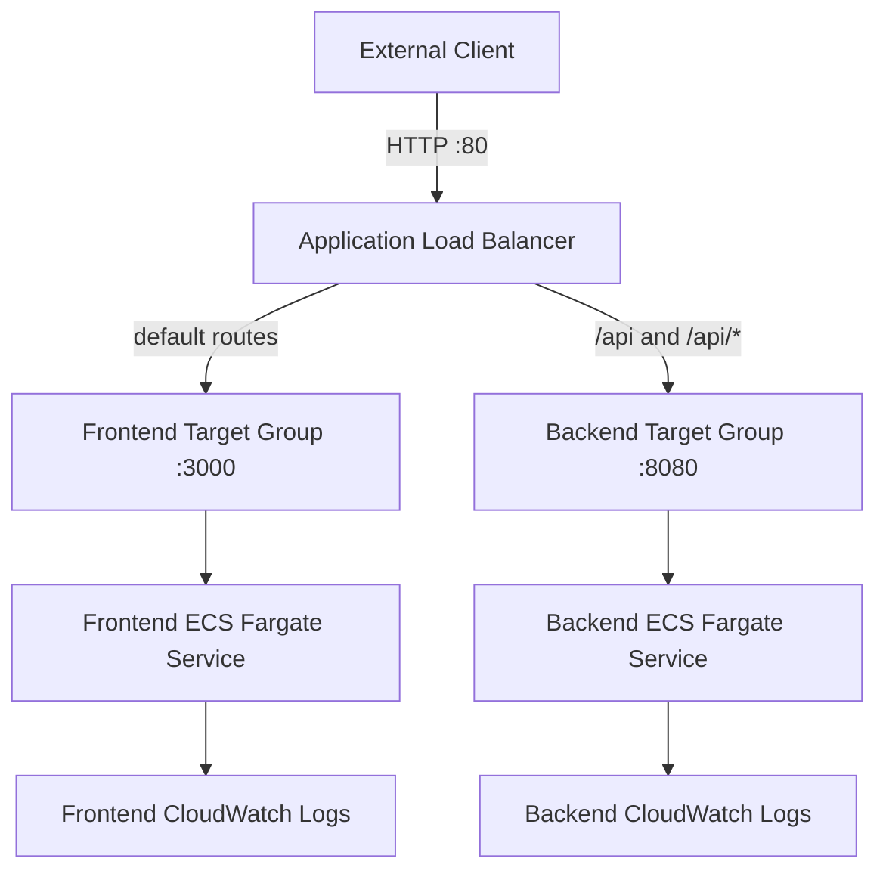

# Architecture

## Purpose

This document describes the deployed architecture of the AWS ECS Fargate CI/CD
challenge environment.

It focuses on how the system is structured, how traffic and deployments move
through it, where trust boundaries exist, and which control plane owns each
part of runtime state.

Implementation commands and reproduction steps are intentionally kept in the
[Implementation Guide](Implementation-Guide/).

Architecture tradeoffs and rationale are recorded in
[Design Decisions](design-decisions.md).

---

# Architecture


---

## 1. System Context

The application is a two-service web application:

```text
React frontend
      |
      | browser request to /api
      v
Express backend
```

Both services are exposed through one public Application Load Balancer.

The primary deployment path uses Jenkins.

A separate `gitops` branch provides a GitHub Actions deployment alternative.

At a high level:

```text
                        GitHub Repository
                              |
                  +-----------+-----------+
                  |                       |
               main branch            gitops branch
                  |                       |
               webhook                   |
                  |                       v
                  v                 GitHub Actions
               Jenkins                   |
                  |                      OIDC
                  |                       |
                  +-----------+-----------+
                              |
                              v
                         Amazon ECR
                              |
                              v
                         Amazon ECS
                              |
                              v
                    Application Load Balancer
                              |
                    +---------+---------+
                    |                   |
                    v                   v
               Frontend              Backend
                Fargate               Fargate
```

---

## 2. Application Request Path

External clients interact with only one public application endpoint: the
Application Load Balancer.



Routing behavior:

```text
/
static assets
all unmatched paths
        |
        v
Frontend target group
HTTP/3000


/api
/api/*
        |
        v
Backend target group
HTTP/8080
```

The frontend uses a relative `/api` path.

The user's browser therefore sends frontend and API requests to the same ALB
origin. The frontend container does not require direct network access to the
backend container.

Backend health checks use:

```text
/health
```

The health endpoint is used by the backend target group and is not separately
published as a public backend route.

---

## 3. Network Architecture

The application VPC uses CIDR:

```text
10.20.0.0/16
```

The network spans two Availability Zones.

Each Availability Zone contains:

```text
1 public subnet
1 private subnet
1 NAT Gateway
1 private route table
```

The architecture is:

```text
                              Internet
                                 |
                                 v
                         Internet Gateway
                                 |
                   +-------------+-------------+
                   |                           |
                   v                           v
            Public Subnet A             Public Subnet B
              10.20.0.0/24                10.20.1.0/24
                   |                           |
               NAT Gateway A               NAT Gateway B
                   |                           |
                   v                           v
            Private Subnet A            Private Subnet B
             10.20.10.0/24              10.20.11.0/24
                   \                           /
                    \                         /
                     +---- ECS Services -----+
```

The Application Load Balancer spans both public subnets.

ECS Fargate tasks run only in the private subnets.

Public IP assignment is disabled for the application tasks.

Each private subnet routes outbound traffic through the NAT Gateway located in
the same Availability Zone.

This avoids making private workloads in one Availability Zone dependent on a
NAT Gateway in another Availability Zone.

### Routing model

Public-tier routing:

```text
0.0.0.0/0
    |
    v
Internet Gateway
```

Private-tier routing:

```text
Private Subnet A
    |
    v
Private Route Table A
    |
    v
NAT Gateway A


Private Subnet B
    |
    v
Private Route Table B
    |
    v
NAT Gateway B
```

The public subnets share one public route table because their routing
requirements are identical.

The private subnets use separate route tables because each must reference its
own Availability-Zone-local NAT Gateway.

---

## 4. Network Security Boundaries

The architecture uses separate security groups for:

```text
Application Load Balancer
Frontend ECS tasks
Backend ECS tasks
Jenkins
```

The application trust path is:

```text
Internet
    |
    | TCP/80
    v
ALB Security Group
    |
    +---- TCP/3000 ----> Frontend Security Group
    |
    +---- TCP/8080 ----> Backend Security Group
```

There is no rule permitting:

```text
Internet -> Frontend :3000
Internet -> Backend  :8080
Frontend -> Backend  :8080
```

The frontend and backend task security groups permit outbound HTTPS so the
private Fargate tasks can reach required AWS services through their NAT
Gateways.

Security groups are stateful, so response traffic for an allowed connection is
automatically permitted.

### Trust-boundary interpretation

The ALB represents the transition between:

```text
public application edge
        |
        v
private workload tier
```

The application workloads are protected by multiple independent controls:

```text
private subnet
+
public IP assignment disabled
+
service-specific security group
+
ALB-only application ingress
+
non-root container runtime
```

---

## 5. ECS Fargate Runtime

The application uses one ECS cluster:

```text
ecs-fargate-cicd-cluster
```

It contains two independent ECS services:

```text
ecs-fargate-cicd-frontend
ecs-fargate-cicd-backend
```

Each task definition uses:

```text
Launch type:       FARGATE
Network mode:      awsvpc
CPU:               512 units / 0.5 vCPU
Memory:            1024 MiB / 1 GiB
Operating system:  Linux
Architecture:      x86_64
```

`awsvpc` networking gives each Fargate task its own network interface and
private IP address.

The services register directly with ALB target groups using target type:

```text
ip
```

### Frontend service

```text
Container port: 3000
Target group:   frontend
Health path:    /
```

### Backend service

```text
Container port: 8080
Target group:   backend
Health path:    /health
```

Both services use ECS deployment circuit breakers with automatic rollback
enabled.

---

## 6. Workload Identity Architecture

Frontend and backend use separate ECS task execution roles.

These roles are infrastructure identities used by ECS/Fargate for operations
such as:

```text
authenticate to ECR
pull the correct container image
create CloudWatch log streams
publish container logs
```

The frontend execution role is scoped to the frontend ECR repository and
frontend log group.

The backend execution role is scoped to the backend ECR repository and backend
log group.

`ecr:GetAuthorizationToken` requires resource `*`, but repository-specific image
pull operations are restricted to the corresponding application repository.

### No application task role

The application containers do not call AWS APIs.

No ECS application task role is therefore assigned.

The identity boundary is:

```text
ECS / Fargate platform
        |
        v
Task execution role
        |
        +--> ECR image retrieval
        +--> CloudWatch logging


Application container
        |
        v
No AWS task role
```

This prevents application code from receiving AWS permissions it does not need.

---

## 7. Container Artifact Architecture

Frontend and backend images are stored in separate private Amazon ECR
repositories:

```text
ecs-fargate-cicd-frontend
ecs-fargate-cicd-backend
```

The repositories use:

```text
immutable image tags
AES256 encryption
project-scoped BASIC scan-on-push configuration
```

The deployment pipelines use immutable source-derived tags instead of
`latest`.

Primary Jenkins deployment tags follow:

```text
<12-character-git-sha>-<jenkins-build-number>
```

The GitHub Actions GitOps alternative uses:

```text
<12-character-git-sha>-<github-run-number>
```

The artifact path is:

```text
Git source
    |
    v
Docker build
    |
    v
Security validation
    |
    v
Immutable ECR image
    |
    v
New ECS task-definition revision
    |
    v
ECS service deployment
```

---

## 8. Primary CI/CD Control Plane: Jenkins

The required deployment path uses Jenkins running on a dedicated Amazon Linux
2023 EC2 instance.

The host is placed in a public subnet and receives a stable Elastic IP.

```text
GitHub main branch
        |
        | webhook
        v
Jenkins EC2
        |
        +--> Checkout
        |
        +--> Verify AWS identity
        |
        +--> Checkov Terraform scan
        |
        +--> Build frontend/backend images
        |
        +--> Trivy HIGH/CRITICAL security gate
        |
        +--> Authenticate to ECR
        |
        +--> Push immutable images
        |
        +--> Register task-definition revisions
        |
        +--> Update ECS services
        |
        +--> Wait for stable services
        |
        +--> Validate / and /api
```

### Jenkins authentication

Jenkins authenticates to AWS using an EC2 instance profile.

No static AWS access key is stored in Jenkins.

The role is scoped to the deployment functions it needs:

```text
push to the two project ECR repositories
describe/register ECS task definitions
update/describe the two application ECS services
describe the application ALB
pass only the frontend/backend ECS execution roles
```

It cannot use its deployment policy to modify the VPC, NAT Gateways, ALB
configuration, ECS cluster, Terraform state bucket, or arbitrary IAM roles.

### Jenkins network exposure

SSH administration is restricted to the approved operator CIDR.

Jenkins TCP/8080 is publicly reachable because the challenge requires external
grading and GitHub webhook delivery.

This is a documented challenge tradeoff rather than the preferred production
exposure model.

---

## 9. GitHub Actions GitOps Alternative

A separate `gitops` branch provides an alternative ECS deployment path.

It does not replace the required Jenkins solution on `main`.

The GitOps path is:

```text
Push to gitops branch
        |
        v
GitHub Actions
        |
        | OIDC identity token
        v
AWS STS
        |
        v
GitHub Actions deployment role
        |
        +--> build frontend/backend images
        +--> push immutable images to ECR
        +--> read current ECS task definitions
        +--> render new image revisions
        +--> deploy ECS services
        +--> wait for service stability
        +--> validate the live application
```

GitHub Actions uses OIDC federation for temporary AWS credentials.

No long-lived AWS access keys are stored in GitHub.

The GitOps role is separate from the Jenkins EC2 role.

---

## 10. Runtime Ownership Model

Several independent control planes modify the deployed system.

Ownership is deliberately separated to prevent one control plane from
reverting valid changes made by another.

| Runtime concern | Owner |
|---|---|
| VPC, subnets, routing, NAT, security groups | Terraform |
| ALB, listeners, target groups | Terraform |
| ECS cluster and baseline services | Terraform |
| ECS execution roles | Terraform |
| Baseline task-definition configuration | Terraform |
| Auto Scaling targets and policies | Terraform |
| Runtime ECS `desired_count` | Application Auto Scaling |
| New application images | CI/CD |
| New task-definition revisions | CI/CD |
| Currently deployed ECS `task_definition` | CI/CD |
| Failed-task replacement | ECS service scheduler |
| Failed deployment rollback | ECS deployment circuit breaker |

The ECS service resources therefore intentionally use:

```hcl
lifecycle {
  ignore_changes = [
    desired_count,
    task_definition
  ]
}
```

This prevents Terraform from fighting Application Auto Scaling or a legitimate
CI/CD deployment.

The relationship is:

```text
Terraform
    |
    +--> declares infrastructure boundaries
    +--> declares scaling capability
    +--> creates baseline runtime


Application Auto Scaling
    |
    +--> changes desired task count


CI/CD
    |
    +--> changes deployed application revision


ECS
    |
    +--> reconciles task health
    +--> replaces failed tasks
    +--> rolls back failed deployments
```

---

## 11. Scaling Architecture

Frontend and backend services scale independently.

Each service is configured with:

```text
Minimum capacity: 1
Baseline desired: 1
Maximum capacity: 4
Metric: ECSServiceAverageCPUUtilization
Target: 50%
Scale-out cooldown: 60 seconds
Scale-in cooldown: 60 seconds
```

The control loop is:

```text
Application traffic
        |
        v
ECS task CPU utilization
        |
        v
CloudWatch metric
        |
        v
Application Auto Scaling target-tracking policy
        |
        v
Change ECS desired_count
        |
        v
ECS starts or removes Fargate tasks
        |
        v
Target group registration / deregistration
```

The scaling control loop is distinct from the ECS health-reconciliation loop.

### Scaling loop

```text
CPU pressure
    |
    v
Application Auto Scaling
    |
    v
desired_count changes
```

### Health-reconciliation loop

```text
Task becomes unhealthy
    |
    v
ECS service scheduler
    |
    v
replacement task
```

A temporary increase in running or pending tasks does not by itself prove an
Auto Scaling event. Scaling evidence must show a change in service desired
capacity caused by the scaling policy.

---

## 12. Availability and Failure Domains

The network foundation spans two Availability Zones.

This provides:

```text
multi-AZ public entry
AZ-local private egress
routing isolation
failure-domain separation
reduced cross-AZ dependency
```

The ALB spans both public subnets.

Each private subnet has its own route table and same-AZ NAT Gateway.

### Application-level limitation

The baseline ECS desired count is:

```text
1
```

A service with one running task is not guaranteed to remain continuously
available during task failure or replacement.

ECS can automatically replace the failed task, but a recovery interval can
exist before the replacement becomes healthy.

The architecture should therefore be described as having:

```text
multi-AZ infrastructure foundation
automated workload recovery
horizontal scaling capability
```

but not as providing zero-interruption workload fault tolerance at baseline.

### CI/CD availability limitation

Jenkins runs on one EC2 instance.

Jenkins is therefore a CI/CD single point of failure.

A Jenkins outage prevents new Jenkins deployments, but it does not stop the
already-running ECS application.

The application runtime and Jenkins deployment control plane remain separate
failure domains.

---

## 13. Terraform State Architecture

Terraform state is stored in a versioned, encrypted S3 backend.

The bootstrap layer and application infrastructure use separate state objects:

```text
bootstrap/terraform.tfstate
infrastructure/terraform.tfstate
```

This keeps backend ownership separate from the infrastructure that consumes the
backend.

The architecture is:

```text
Terraform bootstrap configuration
        |
        v
S3 state bucket
        |
        +--> bootstrap/terraform.tfstate
        |
        +--> infrastructure/terraform.tfstate
```

S3-native locking is used for Terraform operations.

The state bucket must be treated as a dependency of the infrastructure states
stored inside it and should be removed only after dependent infrastructure has
been destroyed.

The GitOps IAM configuration on the `gitops` branch uses its own Terraform
state key so its deployment identity can be managed independently from the main
application infrastructure.

---

## 14. Observability and Validation

Frontend and backend write to independent CloudWatch log groups:

```text
/ecs/ecs-fargate-cicd/frontend
/ecs/ecs-fargate-cicd/backend
```

Independent log groups preserve service-level operational boundaries.

The deployment pipeline validates more than AWS API acceptance.

A successful Jenkins deployment requires:

```text
ECS services reach stable state
        |
        v
Frontend / returns HTTP 200
        |
        v
Backend /api returns a non-empty GUID
```

The externally visible success condition is:

```text
SUCCESS: <GUID>
```

This confirms that the public ALB, frontend service, backend routing, and
backend application are functioning together.

---

## 15. Security Architecture Summary

The project applies security controls at several layers:

```text
Source
    |
    +--> version-controlled infrastructure
    +--> documented architecture decisions

Build
    |
    +--> Checkov IaC visibility
    +--> Trivy HIGH/CRITICAL deployment gate
    +--> ECR vulnerability scanning

Identity
    |
    +--> TerraformExecutionRole for provisioning
    +--> Jenkins EC2 instance profile
    +--> separate frontend/backend execution roles
    +--> GitHub Actions OIDC federation
    +--> no application task role
    +--> no static AWS deployment credentials

Network
    |
    +--> private Fargate tasks
    +--> public IP assignment disabled
    +--> ALB-only application ingress
    +--> service-specific security groups

Runtime
    |
    +--> non-root containers
    +--> immutable image tags
    +--> ECS health reconciliation
    +--> deployment circuit breaker with rollback
```

---

## 16. Deliberate Challenge Tradeoffs

The environment is intentionally optimized for a temporary technical challenge
rather than presented as an ideal production deployment.

### HTTP-only application endpoint

The ALB currently listens on HTTP/80.

A production deployment should normally terminate TLS with an ACM certificate
and redirect HTTP to HTTPS.

### Public Jenkins TCP/8080

Public Jenkins access is required for the challenge grading and webhook model.

A production Jenkins deployment should normally use HTTPS, stronger network
restriction, and preferably separate controller and build-agent roles.

### Single Jenkins host

The Jenkins controller and build workload share one EC2 instance.

A production CI/CD platform should generally isolate build execution from the
controller.

### ECS baseline desired count of one

This satisfies the challenge requirement but does not provide continuous
application availability during every single-task failure scenario.

### Broad HTTPS egress destination

Frontend and backend task egress is restricted to TCP/443, but the destination
CIDR remains `0.0.0.0/0`.

A stricter production design could replace some internet egress with VPC
endpoints and narrower egress policy.

### Two NAT Gateways

One NAT Gateway per Availability Zone improves AZ independence but increases
cost.

The project deliberately accepts that cost for the multi-AZ challenge design.

---

## 17. Architecture Boundaries

This repository intentionally separates four concerns:

```text
Infrastructure definition
        |
        v
Terraform


Host configuration
        |
        v
Ansible


Application deployment
        |
        +--> Jenkins on main
        |
        +--> GitHub Actions on gitops


Runtime reconciliation
        |
        +--> ECS
        +--> Application Auto Scaling
```

No one tool is treated as the owner of every layer.

That separation is central to the design:

```text
Terraform should not overwrite CI/CD deployment revisions.

Terraform should not overwrite Auto Scaling capacity changes.

CI/CD should not redesign infrastructure.

Application containers should not receive AWS permissions they do not use.

ECS should reconcile workload health without requiring Jenkins to repair tasks.
```

---

## 18. Related Documentation

Detailed build and validation steps:

[Implementation Guide](Implementation-Guide/)

Architecture decisions and tradeoffs:

[Design Decisions](design-decisions.md)

Validation evidence:

[Evidence](evidence/)

Jenkins deployment implementation:

[`../Jenkinsfile`](../Jenkinsfile)

Terraform application infrastructure:

[`../terraform/infrastructure/`](../terraform/infrastructure/)

Ansible Jenkins configuration:

[`../ansible/jenkins.yml`](../ansible/jenkins.yml)

The GitHub Actions alternative is maintained on the repository's `gitops`
branch.
