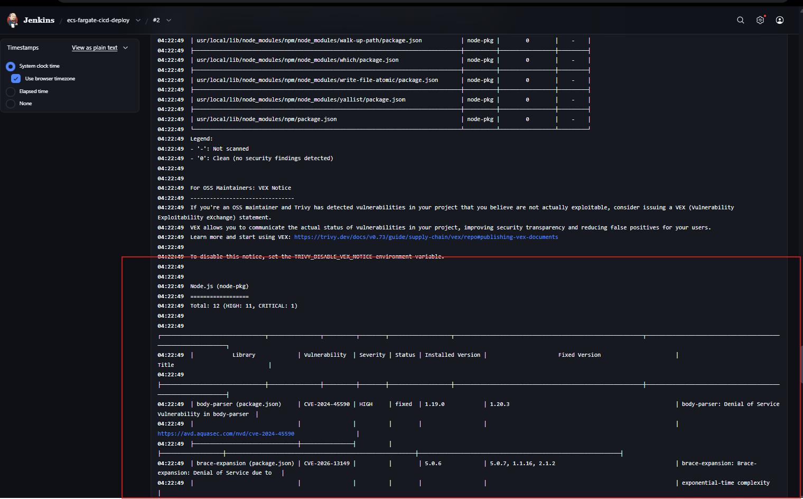
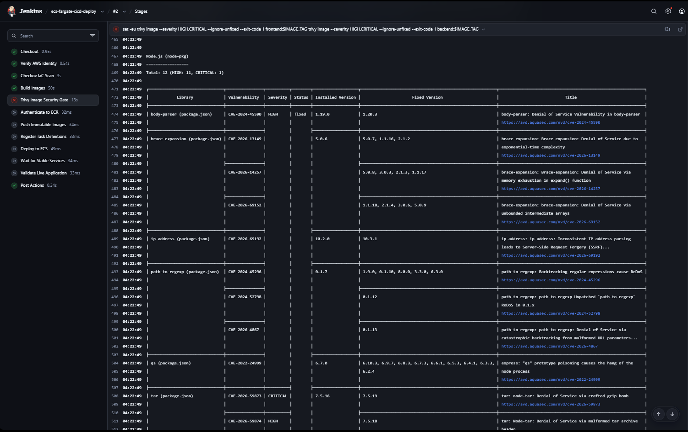
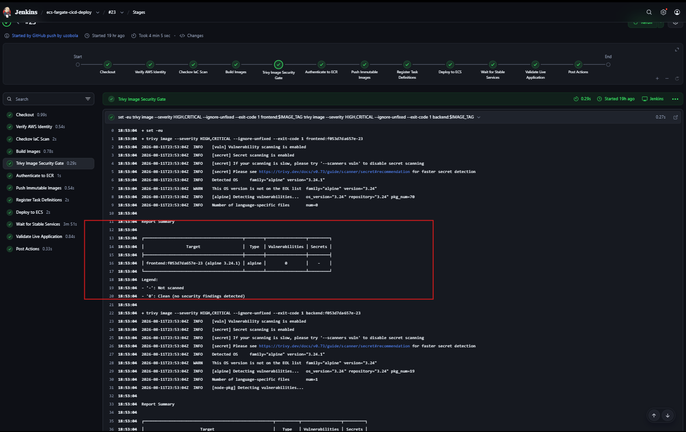
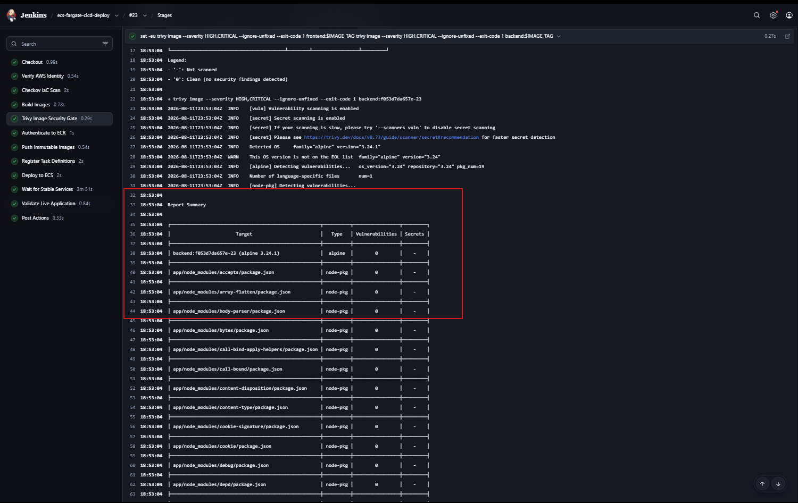
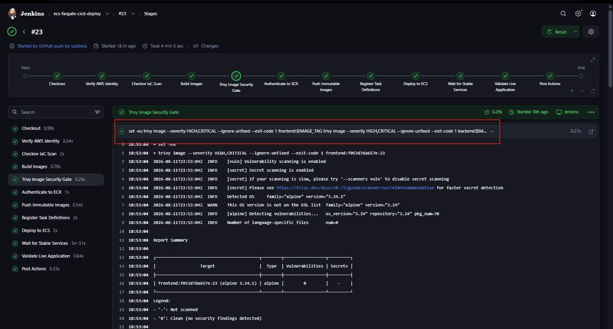

# Trivy Security-Gate Evidence

## Purpose

This artifact demonstrates that the Jenkins **Trivy Image Security Gate** is a
real deployment control rather than a documentation-only security check.

The evidence captures the complete control lifecycle:

```text
Security finding
      ↓
Pipeline blocked
      ↓
Runtime and dependency remediation
      ↓
Same security policy rerun
      ↓
Security gate passed
      ↓
Deployment permitted
```

No security-gate bypass or severity reduction was required.

---

## Security Policy

The Jenkins pipeline scans both application images with:

```text
--severity HIGH,CRITICAL
--ignore-unfixed
--exit-code 1
```

This means fixable `HIGH` or `CRITICAL` vulnerability findings cause Trivy to
return a non-zero exit code.

Because the Jenkins shell step runs with `set -eu`, that non-zero exit code
fails the stage and prevents the later deployment stages from running.

The policy was kept unchanged before and after remediation.

---

## Initial Failure

During implementation, the backend runtime image failed the Trivy security
gate.

Trivy reported:

```text
Total: 12
HIGH: 11
CRITICAL: 1
```

The findings included vulnerable application dependencies and runtime tooling.

One representative finding was:

```text
Package: body-parser
Installed version: 1.19.0
Severity: HIGH
Fixed version available: 1.20.3
```

### Vulnerability findings



The screenshot shows the vulnerable backend image with the aggregate
`11 HIGH / 1 CRITICAL` result and representative package findings.

### Pipeline blocked



The Jenkins stage is marked failed and the log ends with:

```text
script returned exit code 1
```

Subsequent deployment stages did not execute.

This confirms that the Trivy scan was functioning as a blocking deployment
gate.

---

## Remediation

The security remediation was implemented in:

```text
Commit:
e0ac840b5856e3dc50dd11a4b4bb9d3dd87d8590

Message:
Harden backend runtime image and update Express
```

The remediation addressed both the runtime attack surface and the vulnerable
dependency footprint.

Changes included:

- converting the backend container to a multi-stage build
- using the Node image only during dependency installation
- using a minimal Alpine image for the final runtime
- copying only the Node runtime binary and production dependencies into the
  final image
- excluding npm, Yarn, Corepack, package caches, and other build-time tooling
  from the deployed runtime
- continuing to run the application as a non-root user
- adding `dumb-init` for container signal handling
- updating Express and the backend dependency tree to patched versions
- regenerating the package lock file

The remediation changed the container and dependencies rather than weakening or
bypassing the security control.

---

## Passing Rerun

After remediation, the **same Trivy policy** was executed:

```text
--severity HIGH,CRITICAL
--ignore-unfixed
--exit-code 1
```

Both images passed.

### Frontend scan



The frontend report shows:

```text
Vulnerabilities: 0
```

### Backend scan



The backend report also shows:

```text
Vulnerabilities: 0
```

The `body-parser` package that appeared in the earlier failing evidence is also
shown with zero vulnerability findings in the passing backend report.

---

## Deployment Continued Only After the Gate Passed



After the Trivy stage passed, the same Jenkins run continued through:

```text
Authenticate to ECR
Push Immutable Images
Register Task Definitions
Deploy to ECS
Wait for Stable Services
Validate Live Application
```

The pipeline therefore demonstrates the intended control sequence:

```text
Build container images
        ↓
Run Trivy security gate
        ↓
Only clean images continue
        ↓
Publish immutable ECR images
        ↓
Register ECS task definitions
        ↓
Deploy to ECS
        ↓
Validate the live application
```

---

## Evidence Summary

| Evidence | What It Demonstrates |
|---|---|
| `trivy-vulnerability-findings.png` | The original backend runtime contained fixable HIGH/CRITICAL vulnerabilities |
| `trivy-failure-pipeline-blocked.png` | Trivy returned exit code `1` and Jenkins stopped before deployment |
| Remediation commit `e0ac840b5856...` | The container runtime and dependency tree were hardened rather than bypassing the gate |
| `trivy-pass-frontend.png` | The frontend image passed the unchanged Trivy security policy |
| `trivy-pass-backend.png` | The remediated backend image passed the unchanged Trivy security policy |
| `trivy-passing-pipeline.png` | Deployment stages proceeded only after the security gate passed |

---

## Security Lesson

This evidence demonstrates the difference between merely **running a scanner**
and implementing a **security gate**.

A reporting-only scanner can identify vulnerabilities while still allowing an
unsafe artifact to deploy.

In this pipeline:

```text
Trivy finding
    +
non-zero exit code
    +
Jenkins stage failure
```

prevented the deployment workflow from continuing.

The remediation was then validated by rerunning the exact same policy.

The resulting control is therefore:

```text
detect
  ↓
block
  ↓
remediate
  ↓
revalidate
  ↓
deploy
```
